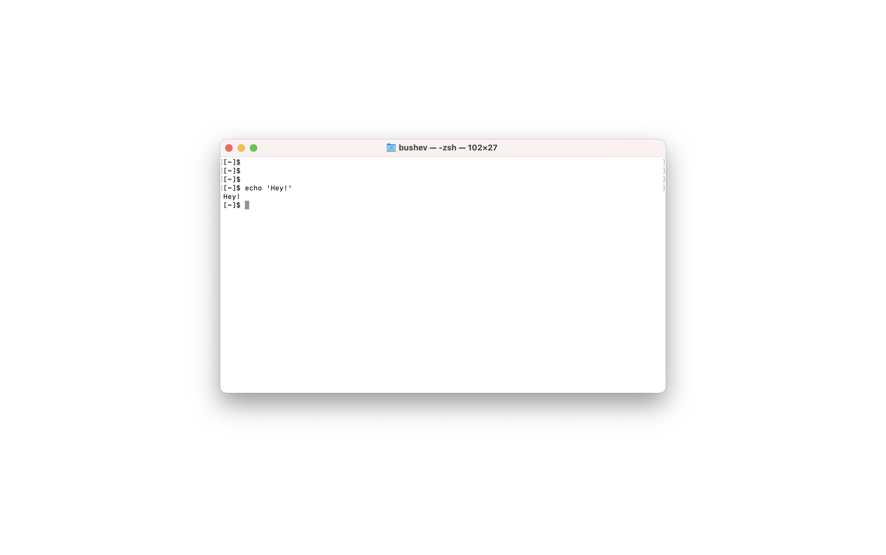

# Test assignment 2021

Create a web application (React + Node.js) that implements web Linux Terminal connected to a locally running Docker container with Ubuntu.

Requirements:

1. User opens the web app on http://localhost:3000
2. Frontend initiates a web socket connection with backend
3. Backend spawn ubuntu in docker and binds container's STDIN / STOUT using web socket with the frontend console.
4. User is able to interact with a web console exactly like a real console. Linux commands like: `tail`, `cd`, `top` should be supported.
5. When the user closes the web console and server should terminate and remove the docker.

You can use any open-source libraries from NPM (like Xterm.js).

Client and Server should run with `yarn start` using the mono-repository. Please, use TypeScript for Server and Frontend.

## Next steps

1. Fork this repository
2. Implement functionality
3. Create Pull Request
