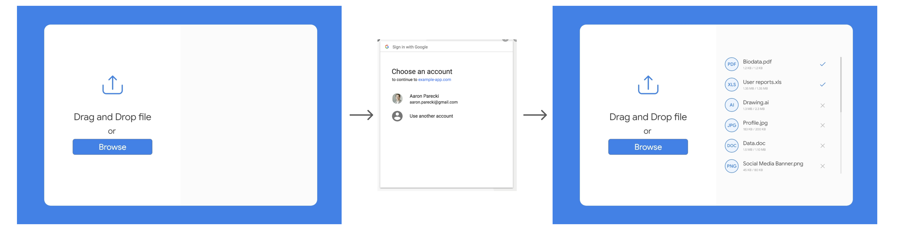

# Test Frontend assignment 2021

Create a web application using React and [Firebase SDK](https://github.com/firebase/firebase-js-sdk) that implements files uploading to the [Firebase Storage](https://firebase.google.com/docs/storage).

## Requirements

1. User must be authenticated (with [Firebase Authentication](https://firebase.google.com/docs/auth) using Google) before uploading files
2. User can download and remove previously uploaded files (even if he closes a browser window and open it again)
3. Please, use TypeScript

## Pay attention to the following

1. UI and functionality must be implemented like on the image above
2. Security
3. Code structure
4. Code quality

## Next steps

1. Fork this repository
2. Implement functionality
3. Create Pull Request